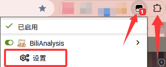

# BiliAnalysis

**轻量 · 简洁 · 开源 · VRChat?**

获取哔哩哔哩视频和直播直链的油猴脚本与浏览器扩展。

## 功能特性

- 支持视频和直播间解析
- 提供本地解析和云端解析
- 极为方便的操作方式

## 快速安装

1. 安装用户脚本管理器：
    - 推荐：[Tampermonkey](https://www.tampermonkey.net)
2. **基于 Chrome / Chromium 内核浏览器：**
    1. 务必开启 “扩展程序” 管理中的 **“开发者模式”**[^1]
    2. 务必开启 “扩展程序” 管理中脚本管理器扩展的 **“允许运行用户脚本”**
    3. 具体可参考 [Tampermonkey 官方指引](https://www.tampermonkey.net/faq.php#Q209)
3. 刷新页面后，插件即可生效
4. 必要时，重启浏览器

[^1]: [Chrome 切换到 Manifest V3后，使用问题](https://github.com/maboloshi/github-chinese/issues/234)

# 版本选择

| 脚本 | GitHub | 国内镜像 |
| :--- | :--- | :--- |
| 稳定版 (推荐) | [安装](https://raw.githubusercontent.com/mmyo456/BiliAnalysis/main/BiliAnalysis-main.user.js) | [安装](https://i.ouo.chat/jsd/gh/mmyo456/BiliAnalysis@main/BiliAnalysis-main.user.js) |
| 开发版 | [安装](https://raw.githubusercontent.com/mmyo456/BiliAnalysis/main/BiliAnalysis-dev.user.js) | [安装](https://i.ouo.chat/jsd/gh/mmyo456/BiliAnalysis@main/BiliAnalysis-dev.user.js) |

## 使用方法

将鼠标悬停在部分网页封面图

视频播放页左上角

选择"视频解析"即可获取直链。

## 设置菜单

如图展示

 

> **重要提示**：云解析依赖公共服务器，请勿滥用。如在 VRChat 世界或网站中使用，请保留项目信息。
> 
## 欢迎打赏

伴随着人传人，越来越多人发现了项目，也伴随着我们的云服务资产费用正在持续增高，如果觉得有帮助，欢迎 [赞助支持](https://www.ouo.chat/sponsor)。

# 贡献和致谢

- [ouo.chat](https://ouo.chat/) - 提供云端解析服务资源
- [BiliBili-JX](https://github.com/gujimy/BiliBili-JX) - 提供的代码参考

  
### 特别感谢下开发者的贡献：  

## 许可证

[GPL-3.0 License](https://github.com/mmyo456/BiliAnalysis/blob/main/LICENSE)

## Star History

